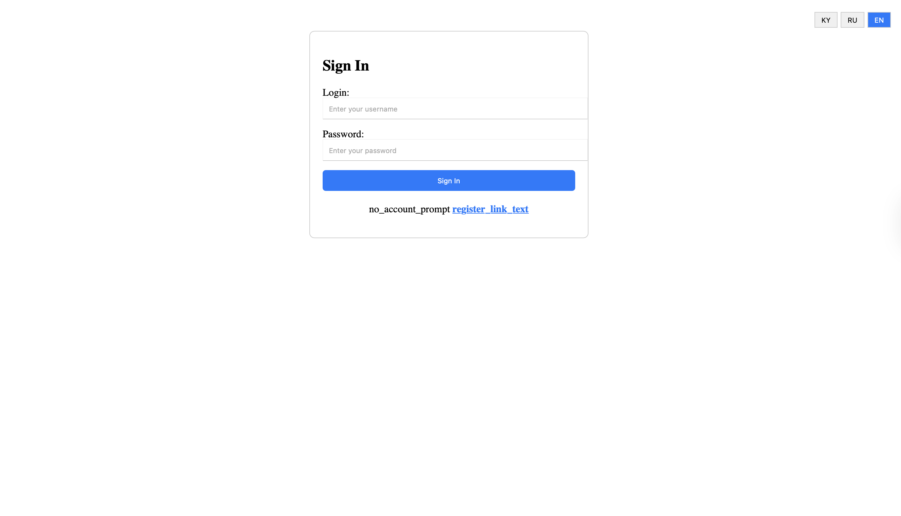
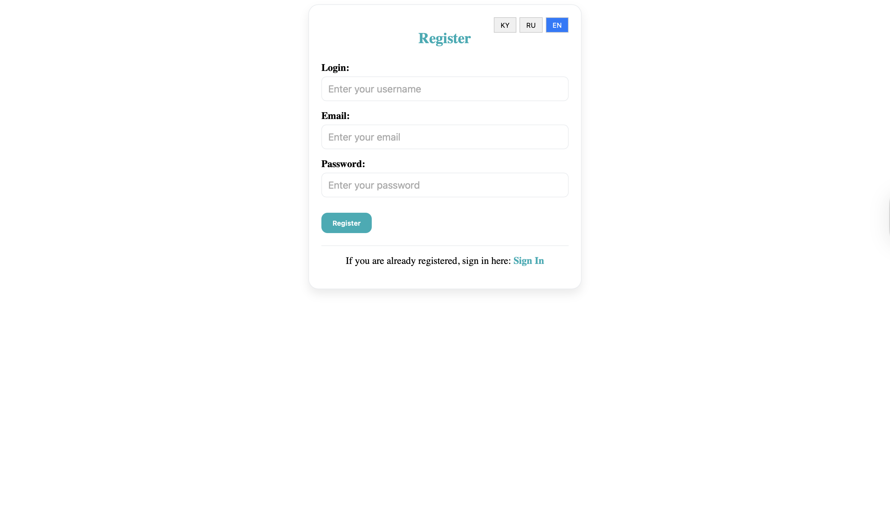
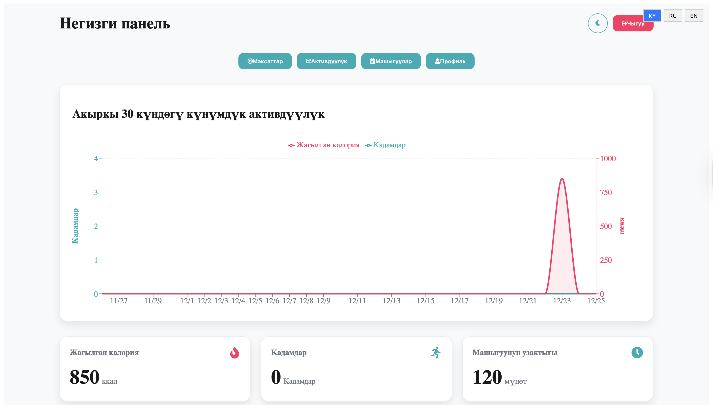
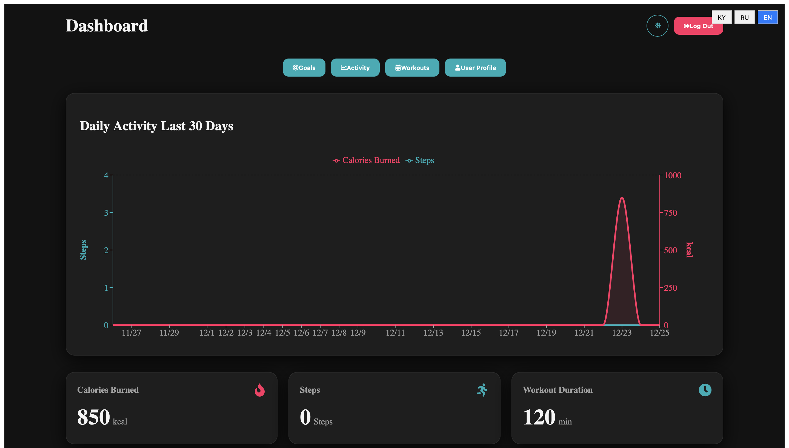
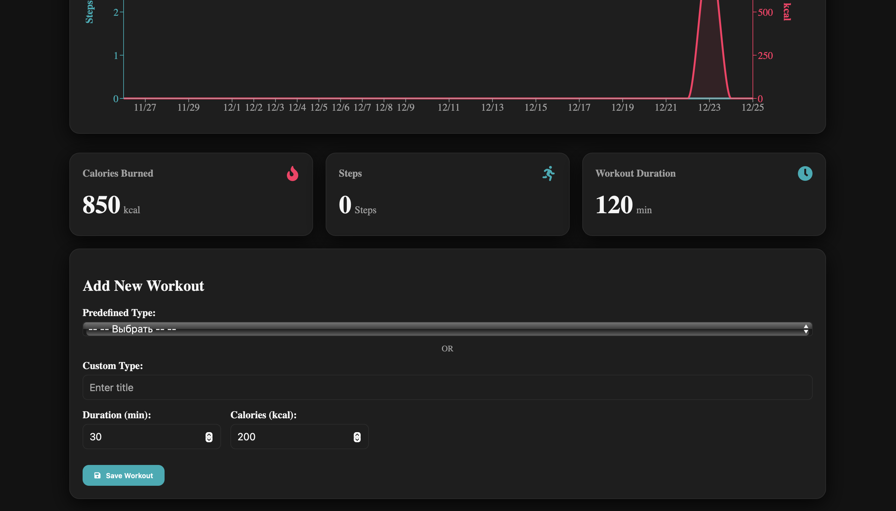
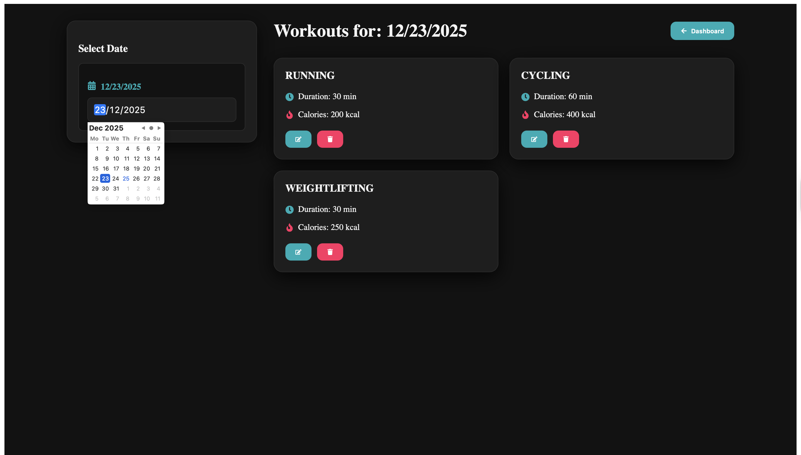
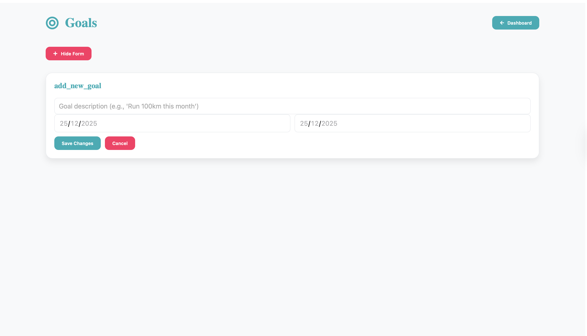
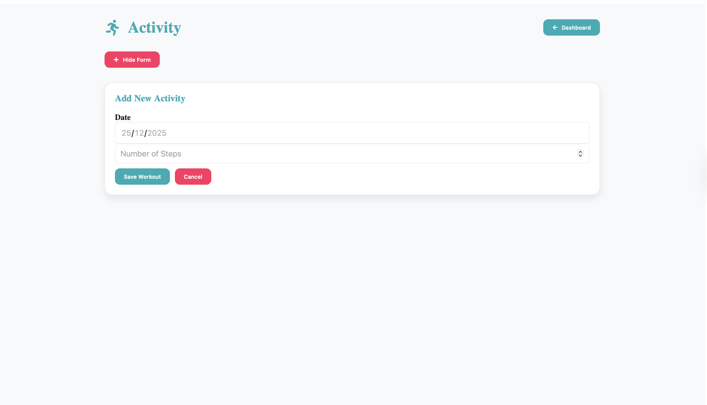
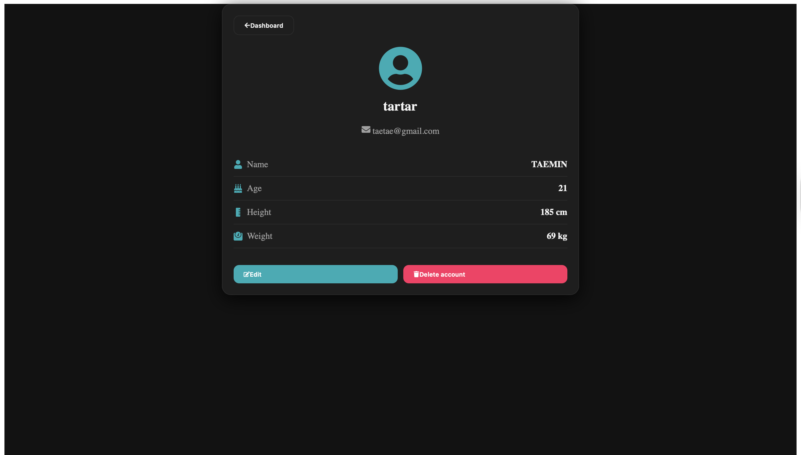

# 🏔️ Ala-Too Fit

**Ala-Too Fit** is a professional **Full-Stack Fitness Management System** inspired by the excellence of **Ala-Too International University**. This platform provides a localized, data-driven experience for users to track workouts, set goals, and monitor health metrics.

---

## 📸 Project Showroom

### 🔐 **Authentication & Localization**
| **Sign In** | **Sign Up** |
|:---:|:---:|
|  |  |
| *Secure **JWT-based** entry* | *Multilingual support (**KY, RU, EN**)* |

### 📊 **The Dashboard Experience**
| **Kyrgyz Interface** | **Dark Mode** |
|:---:|:---:|
|  |  |
| *Full **Кыргызча** translation* | *Eye-friendly night viewing* |

### 🏋️ **Workout & Activity Tracking**
| **Add New Workout** | **Workout List** |
|:---:|:---:|
|  |  |
| *Custom & Predefined types* | *Daily logs with calorie tracking* |

### 🎯 **Goals & Progress**
| **Fitness Goals** | **Activity Tracking** |
|:---:|:---:|
|  |  |
| *Set and achieve milestones* | *Step & calorie visualization* |

### 👤 **User Management**
| **User Profile** |
|:---:|
|  |
| *Manage **Height, Weight, & Age*** |

---

## 🌟 Core Features

* **Localized for Kyrgyzstan:** Full translation support for **Кыргызча**, **Русский**, and **English**.
* **Smart Analytics:** Interactive **Chart.js** graphs showing progress over the last **30 days**.
* **Comprehensive Metrics:** Track **BMI-related data** to see physical changes over time.
* **Flexible Workouts:** Support for **Running**, **Cycling**, **Weightlifting**, and **Custom activities**.
* **Goal-Oriented:** A dedicated system to create and manage personal **Fitness Milestones**.

---

## 🛠️ Technical Architecture

### **Frontend**
* **React.js (Vite):** Blazing fast **UI** performance.
* **i18next:** Advanced **Internationalization** framework.
* **Axios:** Secure **REST API** handling.
* **Context API:** Global state for **Auth** and **Theme**.

### **Backend**
* **Spring Boot:** Enterprise-grade **Java** backend.
* **Spring Security:** Expert handling of **CORS**, **JWT**, and **Security Filter Chains**.
* **PostgreSQL:** Reliable storage for user and workout data.

---

## 🔧 Technical Challenges Overcome
* **CORS Policy:** Solved **403 Forbidden** errors by implementing a custom `CorsConfigurationSource` allowing cross-origin requests from Vercel to Render.
* **Cold Starts:** Optimized frontend **Axios timeouts** to account for Render's free-tier "sleep" mode.
* **Preflight Requests:** Configured Spring Security to permit all **OPTIONS** requests globally.

---
